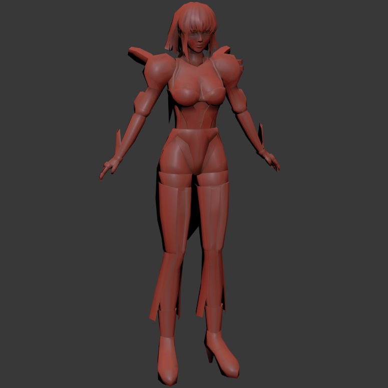

# Battle Raper PC MaxScript Importer

This repository contains a MaxScript (`mxs`) for importing 3D models from the PC game **Battle Raper** into Autodesk 3ds Max.



## Features

- Import `.xm` and `.xa` model files from Battle Raper PC.
- Extract and apply textures from model files.
- Reconstruct geometry with proper vertex positions, normals, and UV coordinates.
- Generate materials with diffuse and reflection maps.

## Requirements

- Autodesk 3ds Max (compatible versions recommended).
- Basic familiarity with running MaxScripts in 3ds Max.

## Installation

1. **Download or Clone the Repository**

   ```bash
   git clone https://github.com/coreynguyen/mxs_battle_raper_pc.git
   ```

2. **Copy the Script**

   Place the `imp_battleraper.ms` file into your 3ds Max scripts directory or a convenient location.

3. **Prepare Sample Files (Optional)**

   - Extract the `samples.zip` found in the `assets` folder.
   - This will provide you with sample `.xm` and `.xa` files to test the importer.

## Usage

1. **Launch Autodesk 3ds Max**

   Open 3ds Max on your computer.

2. **Run the MaxScript**

   - Go to **Scripting > Run Script** from the main menu.
   - Navigate to where you saved `imp_battleraper.ms` and select it.
   - Alternatively, you can drag and drop the script file into the 3ds Max viewport.

3. **Open the Importer Dialog**

   The **Battle Raper** importer dialog will appear upon running the script.

4. **Import a Model**

   - Click the **Import** button on the dialog.
   - In the file selection window, navigate to the folder containing the `.xm` or `.xa` files.
   - Select the desired file and click **Open**.

5. **Wait for Processing**

   - The script will read the model file, extract textures, and construct the 3D model.
   - Processing time may vary depending on the file size and complexity.

6. **View the Imported Model**

   - Once completed, the model will appear in the 3ds Max viewport.
   - Textures will be applied, and materials will be set up automatically.

## Samples

- **Sample Files**

  - Use the sample files provided in `assets/samples.zip` to test the importer.
  - Extract the ZIP file to access sample `.xm` and `.xa` files.

- **Preview**

  - Refer to `assets/preview.jpg` to see an example of an imported model using this script.

## Notes

- **Texture Extraction**

  - Extracted textures are saved in a `textures` folder located in the same directory as the source model file.
  - Ensure you have write permissions in the directory to allow texture extraction.

- **Model Positioning**

  - Imported models are positioned based on data from the source files.
  - You may need to adjust the model's position, rotation, or scale to fit your scene.

- **Performance**

  - Large or complex models may take longer to import.
  - Be patient and avoid interrupting the script during execution.

## Troubleshooting

- **Script Errors**

  - If you encounter errors, ensure that all variables are correctly scoped within the script.
  - Verify that you are using a compatible version of 3ds Max.

- **Missing Textures**

  - Check that the textures are correctly extracted to the `textures` folder.
  - Ensure that texture file paths are correctly set in the material editor.

## License

This project is released under [The Unlicense](LICENSE). You are free to use, modify, and distribute this script without any restrictions.

## Disclaimer

- **Use at Your Own Risk**

  - This script is provided "as is" without warranty of any kind.
  - The author is not responsible for any damage or legal issues arising from the use of this script.

- **Intellectual Property**

  - Models and assets from Battle Raper are the property of their respective owners.
  - Ensure that you have the right to use the game assets in accordance with the game's EULA and local laws.

## Acknowledgments

- **Illusion**

  - Creator of Battle Raper. Visit their [official website](http://www.illusion.jp/) for more information.

